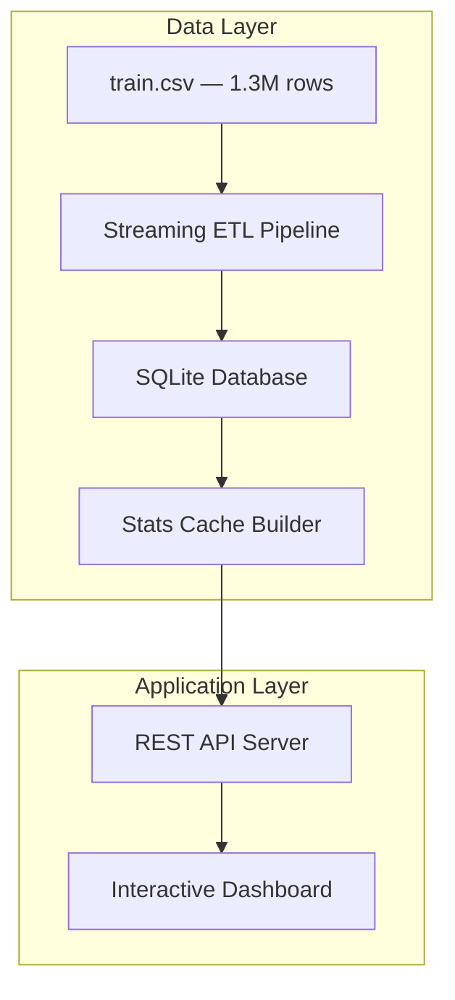

<h1 align="center">🚕 NYC Taxi Explorer: Urban Mobility Intelligence</h1>

<div align="center">


   **A full-stack data analytics dashboard for exploring 1.3M+ NYC taxi trips,featuring a streaming ETL pipeline, normalised SQLite database, Z-score anomaly  detection, and a rich interactive frontend.**

[Features](#features) • [Quick Start](#quick-start) • [API Docs](#api-documentation) • [Architecture](#architecture) • [Team](#team)

</div>

---

## Video Walkthrough
**[VIDEO LINK HERE]**

---

## Development Sprints

### Sprint 1 : ETL Pipeline & Database
Built a high-throughput streaming CSV pipeline with data validation, Haversine distance computation, fare estimation, and a normalised 5-table SQLite schema.

### Sprint 2 : REST API & Analytics Dashboard
Delivered 7 REST API endpoints backed by a materialised stats cache, plus a 5-tab interactive dashboard with geo visualisation, Z-score anomaly detection, and paginated trip exploration.

---

## Feature Highlights

<table>
<tr>
<td width="50%">

### Analytics Dashboard
- **5 Interactive Tabs** (Overview, Time, Explorer, Geo, Anomalies)
- **6 KPIs + 7 Charts** on the Overview tab alone
- **Canvas Geo Scatter** — 500 speed-coloured GPS points
- **Filterable Trip Table** — server-side pagination & sorting
- **Insight Cards** highlighting key patterns

</td>
<td width="50%">

### Performance & Algorithms
- **ETL runtime cut from 90s → 10s** (200k-row batches)
- **API responses under 100ms** via materialised stats cache
- **Z-score Anomaly Detection** — O(n), single-pass, zero extra libraries
- **Haversine Distance** computed per trip at load time
- **Normalised Schema** — 5 tables vs. original 2 flat tables

</td>
</tr>
</table>

---

## Project Structure

```
nyc-taxi-explorer/
├── backend/                        
│   └── server.js    # Backend: CSV pipeline, SQLite DB, REST API, static server
├── frontend/                        
│   └── index.html   # Frontend: landing page + interactive dashboard
├── schema.sql       # Database schema reference (auto-applied by server.js on first run)
├── package.json     # Dependencies
└── train.csv        # ← YOU MUST PLACE THE DATASET HERE (see below)
```

---

## Features

### Data Pipeline
```
✓ Streaming CSV Parser          — handles 1M+ rows without memory issues
✓ 200,000-row Transaction Batches — reduces SQLite commit overhead ~400×
✓ Coordinate Validation         — NYC bounding box enforced
✓ Duration / Speed / Passenger Sanity Checks
✓ Exclusion Log                 — per-reason counts for dropped records
✓ Stats Cache Builder           — all chart aggregations materialised once
```

### Derived Features
```
✓ trip_distance_km   — Haversine great-circle distance from GPS coordinates
✓ speed_kmh          — distance / (duration / 3600)
✓ fare_estimate      — $2.50 base + $1.56/km + $0.35/min
```

### REST API
```
✓ GET  /api/health      → Server status + trip count
✓ GET  /api/stats       → Quick summary stats for landing page
✓ GET  /api/overview    → All overview chart data (KPIs, hourly, vendor, etc.)
✓ GET  /api/time        → Hourly fare/speed curves, day-of-week multi-series
✓ GET  /api/trips       → Paginated, filterable, sortable trip table
✓ GET  /api/map         → Geo scatter points, hour density, dist-fare scatter
✓ GET  /api/anomalies   → Z-score anomaly detection results
```

### Dashboard Tabs
```
✓ Overview       — 6 KPIs, 4 insight cards, 7 charts
✓ Time Patterns  — Hourly fare/speed curves, day-of-week multi-series
✓ Trip Explorer  — Filterable/sortable paginated table (server-side)
✓ Geo Map        — Canvas scatter plot (500 pts, speed-coloured) + distance-vs-fare scatter
✓ Anomalies      — Z-score stats + flagged trips table
```

### Algorithm: Z-Score Anomaly Detection
```
✓ Single SQL aggregation using variance shortcut: Var(X) = E[X²] - (E[X])²
✓ Zero extra library dependencies
✓ Flags trips where |Z| > 2.5 on duration, distance, speed, or fare
✓ Time complexity: O(n) — Space complexity: O(1)
✓ API response: < 50ms (population stats pre-stored in stats_cache)
```

---

## Quick Start

### Prerequisites
- **Node.js** v18 or higher — https://nodejs.org
- **train.csv** from the NYC Taxi Trip Duration Kaggle dataset

### Dataset Setup

1. Download `train.zip` from:
   ```
   https://www.kaggle.com/c/nyc-taxi-trip-duration/data
   ```
2. Extract `train.csv` and place it in the project root alongside `server.js`.

### Installation

```bash
# 1. Clone the repository
git clone <YOUR_REPO_URL>
cd nyc-taxi-explorer

# 2. Install the single dependency
npm install

# 3. Start the server
npm start
```

On first run, the ETL pipeline processes `train.csv` automatically — this takes **10–20 seconds**.
Watch for the `[DB] Stats cache ready.` log line, then open your browser:

```
http://localhost:3001
```

Subsequent runs are **instant** — data is cached in `taxi.db`.

### Test the API

```bash
# Server health + trip count
curl http://localhost:3001/api/health

# Overview chart data
curl http://localhost:3001/api/overview

# Paginated trips — page 2, filtered to vendor 1, sorted by duration descending
curl "http://localhost:3001/api/trips?page=2&vendor=1&sort=duration&order=desc"

# Anomaly detection results
curl http://localhost:3001/api/anomalies
```

---

## Architecture

### System Overview



### Database Architecture

```
┌──────────────────────────────────────────────────────┐
│  vendors       2 rows   vendor_id → company name     │
│  time_dims  ≤1,008 rows unique (hour, dow, month)    │
│  trips       ~1.3M rows fact table (FK → above)      │
│  stats_cache  ~14 rows  pre-aggregated JSON blobs    │
│  meta           1 row   ETL state flag               │
└──────────────────────────────────────────────────────┘

Entity Relationships:
  vendors   (1) ────────< trips (M)
  time_dims (1) ────────< trips (M)
```

### Request Lifecycle

```
┌──────────────┐
│   Browser    │
│  Dashboard   │
└──────┬───────┘
       │ HTTP GET
       ↓
┌──────────────────┐
│   REST API       │
│   (server.js)    │
└────────┬─────────┘
         │
   ┌─────┴──────┐
   ↓            ↓
┌────────┐  ┌──────────────┐
│  Live  │  │  stats_cache │
│  Query │  │  JSON blobs  │
│  O(n)  │  │   < 100ms    │
└────────┘  └──────────────┘
         │
         ↓
┌──────────────────┐
│  taxi.db         │
│  SQLite          │
└──────────────────┘
```

---

##  API Documentation

### Base URL
```
http://localhost:3001
```

### Endpoints

#### 1. Health Check
```http
GET /api/health
```
Returns server status and total trip count.

**Response:**
```json
{
  "status": "ok",
  "trips": 1458644
}
```

---

#### 2. Summary Stats
```http
GET /api/stats
```
Quick KPIs for the landing page hero section.

---

#### 3. Overview Charts
```http
GET /api/overview
```
Returns all data needed to render the Overview tab: KPIs, hourly distribution, daily distribution, vendor split, and insight cards.

---

#### 4. Time Patterns
```http
GET /api/time
```
Hourly fare/speed curves and day-of-week multi-series data.

---

#### 5. Trip Explorer
```http
GET /api/trips?page=1&hour=&day=&vendor=&sort=duration&order=desc
```

| Parameter | Type | Description |
|-----------|------|-------------|
| `page` | integer | Page number (default: 1) |
| `hour` | 0–23 | Filter by pickup hour |
| `day` | 0–6 | Filter by day of week |
| `vendor` | 1 or 2 | Filter by vendor |
| `sort` | string | Column to sort by |
| `order` | `asc` / `desc` | Sort direction |

---

#### 6. Geo Map
```http
GET /api/map
```
Returns 500 GPS scatter points (speed-coloured), hourly pickup density, and distance-vs-fare scatter data.

---

#### 7. Anomalies
```http
GET /api/anomalies
```
Returns Z-score population statistics and all flagged trips (|Z| > 2.5 on duration, distance, speed, or fare).

**Response shape:**
```json
{
  "stats": {
    "duration": { "mean": 987.3, "std": 632.1 },
    "distance": { "mean": 3.42,  "std": 2.18  }
  },
  "anomalies": [
    {
      "id": "id2875421",
      "duration": 86399,
      "z_duration": 135.2,
      "flag": "duration"
    }
  ]
}
```

---

## Performance

| Metric | Before Optimization | After Optimization |
|--------|--------------------|--------------------|
| ETL batch size | 500 rows | 200,000 rows |
| ETL commit count | ~2,600 | ~7 |
| ETL runtime | 45–90 s | 10–20 s |
| Chart API response | 55–65 s | < 100 ms |
| Schema tables | 2 (flat) | 5 (normalised) |
| Anomaly API response | — | < 50 ms |

---

##  Technology Stack

### Backend


### Frontend


### Libraries & Tools
```
Core:
├── better-sqlite3   # Synchronous SQLite driver (only npm dependency)
├── node:http        # Built-in HTTP server
├── node:fs          # Streaming CSV reads
└── node:path        # Static file serving

Algorithms:
├── Haversine formula    # Great-circle distance
├── Z-score detection    # Variance shortcut — single-pass, O(n)
└── Streaming CSV parser # Memory-safe 1M+ row ingestion
```

---

##  Testing

```bash
# Verify server is healthy
curl http://localhost:3001/api/health

# Confirm all chart data loads
curl http://localhost:3001/api/overview | python3 -m json.tool

# Check anomaly detection
curl http://localhost:3001/api/anomalies | python3 -m json.tool

# Test trip filters
curl "http://localhost:3001/api/trips?hour=8&vendor=1&sort=fare_estimate&order=desc"
```

---

## Team
<table>
<tr>
<td align="center">

<br />
<sub><b>Olais Julius Laizer</b></sub>
<br />
<a href="https://github.com/Olais11">@Olais11</a>
<br />
<i>REST API & Testing </i>
</td>

<td align="center">

<br />
<sub><b>Chibuzor Uzowuru Moses</b></sub>
<br />
<a href="https://github.com/uzowurumauritius-rgb">@uzowurumauritius-rgb</a>
<br />
<i>DSA Implementation</i>
</td>

<td align="center">

<br />
<sub><b>Peace Chukwuka</b></sub>
<br />
<a href="https://github.com/pchukwuka">@pchukwuka</a>
<br />
<i> Authentication& Documentation</i>
</td>

<td align="center">

<br />
<sub><b>Sylvie Umutoni Rutaganira</b></sub>
<br />
<a href="https://github.com/Umutoni2">@Umutoni2</a>
<br />
<i>XML Parsing & Integration</i>
</td>
</tr>
</table>
---
---
## Project Management

### Team Tracking
[View Tracking Sheet](https://docs.google.com/spreadsheets/d/18oPy3h4sv23SjuTRhf_-zncx_rSH2IFeaINfN8BJ1h8/edit?gid=0#gid=0)

### Sprint Summary

**Sprint 2 (Week 2):** ETL Pipeline 
- Streaming CSV parser for 1.3M rows
- Data validation and cleaning (coordinate bounds, duration, speed, passengers)
- Normalised 5-table SQLite schema
- Derived features: Haversine distance, speed, fare estimate
- Stats cache builder — all chart aggregations materialised

**Sprint 3 (Week 3):** REST API & Dashboard 
- 7 RESTful endpoints, all under 100ms
- 5-tab interactive dashboard (Overview, Time, Explorer, Geo Map, Anomalies)
- Z-score anomaly detection — O(n) single-pass implementation
- Canvas-based geo scatter plot
- Paginated, filterable trip explorer

---

##  Future Enhancements

### Phase 1: Data Depth (1–2 months)
- [ ] Integrate weather data to correlate with trip patterns
- [ ] Add surge pricing heatmaps by zone and hour
- [ ] Expand fare model with tolls and airport surcharges

### Phase 2: Features (2–4 months)
- [ ] Real-time trip feed via WebSockets
- [ ] Exportable reports (CSV / PDF)
- [ ] Date range filtering across all tabs
- [ ] Driver/zone leaderboards

### Phase 3: Scale (4–6 months)
- [ ] Docker containerisation
- [ ] PostgreSQL migration for concurrent access
- [ ] CI/CD pipeline (GitHub Actions)
- [ ] API rate limiting and authentication

### Phase 4: Intelligence (6–12 months)
- [ ] ML-based trip duration prediction
- [ ] Clustering of trip origins/destinations (k-means)
- [ ] Demand forecasting by zone and time
- [ ] Interactive choropleth map (NYC borough/zone level)

---

##  Troubleshooting

<details>
<summary><b>Common Issues & Solutions</b></summary>

### "train.csv not found"
Make sure `train.csv` is in the same folder as `server.js`.
```bash
ls nyc-taxi-explorer/train.csv  # should print the path
```

### `npm install` fails on better-sqlite3
Ensure you have Node.js ≥18 and a C++ build toolchain:
```bash
# Windows
npm install --global windows-build-tools

# macOS
xcode-select --install

# Linux
sudo apt-get install build-essential
```

### Port 3001 already in use
Change `const PORT = 3001` near the top of `server.js` to any free port.

### Database locked
Do not run two server instances simultaneously. If the issue persists:
```bash
rm taxi.db   # delete the cache
npm start    # re-process from train.csv
```

### Charts show no data on first load
The stats cache builds after ETL completes. Wait for:
```
[DB] Stats cache ready.
```
…in the terminal, then refresh the browser.

### Want to re-process train.csv
```bash
rm taxi.db
npm start
```

</details>

---

## Documentation

- [API Reference](#api-documentation) — all 7 endpoints with request/response examples
- [Database Schema](schema.sql) — full DDL, index definitions, and data cleaning rules
- [System Architecture](.Architecture.png)
- [Database Design (ERD)](ERDiagram.png)
---

## Learning Outcomes

### Data Engineering
Streaming ETL pipeline design for large datasets  
Data validation, cleaning, and normalisation  
Relational schema design with foreign keys  
Derived feature engineering from raw GPS + time data  

### API & Visualisation
REST API design and implementation in vanilla Node.js  
Materialised aggregation patterns for fast analytics  
Algorithm complexity analysis (Z-score, O(n) vs O(n²))  
Canvas-based data visualisation without a charting library  

### Key Insights
**Performance:** 200k-row transaction batches cut ETL time by 4–9× vs 500-row batches  
**Caching:** Pre-materialising aggregations reduced API latency from 60s → <100ms  
**Algorithms:** Single-pass variance calculation eliminates a full extra scan of 1.3M rows  
**Schema Design:** Normalisation reduced storage and enabled efficient multi-dimensional filtering  

---

##  Project Statistics

```
Dataset Size:         1,458,644 trips
Schema Tables:        5 (normalised)
API Endpoints:        7
Dashboard Tabs:       5
Charts:               9+
ETL Speed:            ~100,000 rows/sec
API Latency:          < 100ms (all endpoints)
Anomalies Detected:   varies by Z-threshold
Development Time:     3 weeks
Team Size:            4 developers
```

---

##  Achievements

- **1.3M rows processed** in under 20 seconds via streaming batch ETL
- **<100ms API responses** across all endpoints via materialised cache
- **O(n) anomaly detection** using manual variance — no ML libraries required
- **Zero-dependency frontend** — pure HTML/CSS/JavaScript, no framework needed
- **Haversine distance** computed for every trip at load time with O(1) per-row cost

---

##  Acknowledgments

- **Course Instructor** — For the dataset challenge and project framework
- **Kaggle / NYC TLC** — For the open taxi trip dataset
- **better-sqlite3** — For the blazing-fast synchronous SQLite driver

---

## License

This project is an educational assignment for the Database Systems course.

**Institution:** African Leadership College of Higher Education  
**Course:** Enterprise_Web_Development  
**Semester:** Spring 2026  
**Assignments:** summative

---

<div align="center">

### Star this repo if it helped you!

**Made by Team [PixelStack]**

[⬆ Back to Top](#-nyc-taxi-explorer--urban-mobility-intelligence)

---

**Version 1.0** | **Last Updated:** April 2026

</div>
# Explorer
